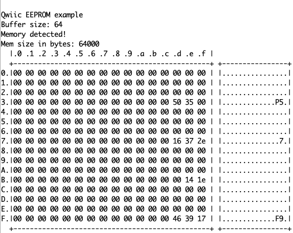

# BastWAN_EEPROM

A project demonstrating how to use an EEPROM on the BastWAN.




## SparkFun_External_EEPROM.h

You need to define the buffer lengths in `SparkFun_External_EEPROM.h`. BastWAN isn't recognized. Around line 56:

```c
#elif defined(ESP32)
#define I2C_BUFFER_LENGTH_RX I2C_BUFFER_LENGTH
#define I2C_BUFFER_LENGTH_TX I2C_BUFFER_LENGTH

// DEFINITION FOR BASTWAN
#elif defined(_VARIANT_ELECTRONICCATS_BASTWAN_)
#define I2C_BUFFER_LENGTH_RX SERIAL_BUFFER_SIZE
#define I2C_BUFFER_LENGTH_TX SERIAL_BUFFER_SIZE

#else
#pragma GCC error "This platform doesn't have a wire buffer size defined. Please contribute to this library!"

#endif
```

Once this is done, you should be able to compile the code without problems.
